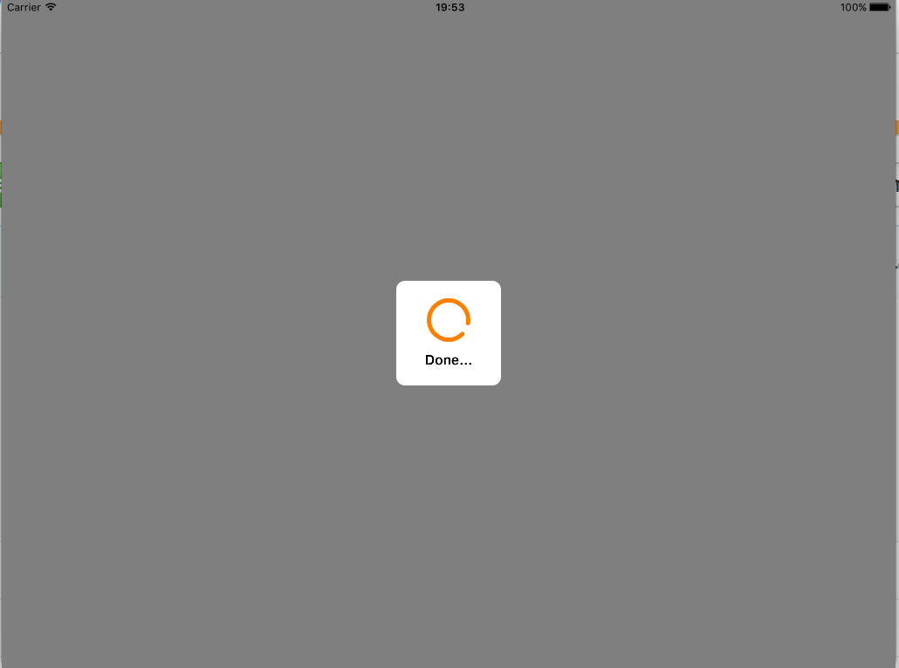

# RKIndicator



## Usage

```swift
import RKIndicator
```

Show RKIndicator without text:
```swift
RKIndicator.show(animated: true)
```

Show RKIndicator with text:
```swift
RKIndicator.show(title: "Loading...", animated: true)
```

Hide RKIndicator:
```swift
RKIndicator.hide()
```

## Configuration
RKIndicator has simple configuration system.

You need to create RKIndicator.Config object, set params:
```swift
var config : RKIndicator.Config = RKIndicator.Config()
config.size = 150
config.spinnerColor = .redColor()
config.foregroundColor = .blackColor()
config.foregroundAlpha = 0.5
```
and set new config for RKIndicator:
```swift
RKIndicator.setConfig(config)
```

#### Current available params:

* size - Size of loader
* spinnerColor - Color of spinner view
* spinnerLineWidth - Line width of spinner view layer
* titleTextColor - Color of title text
* titleTextFont - Font of title text
* backgroundColor - Background color for loader
* foregroundColor - Foreground color for loader
* cornerRadius - Radius of corners of loader
* foregroundAlpha - Alpha property for foreground


